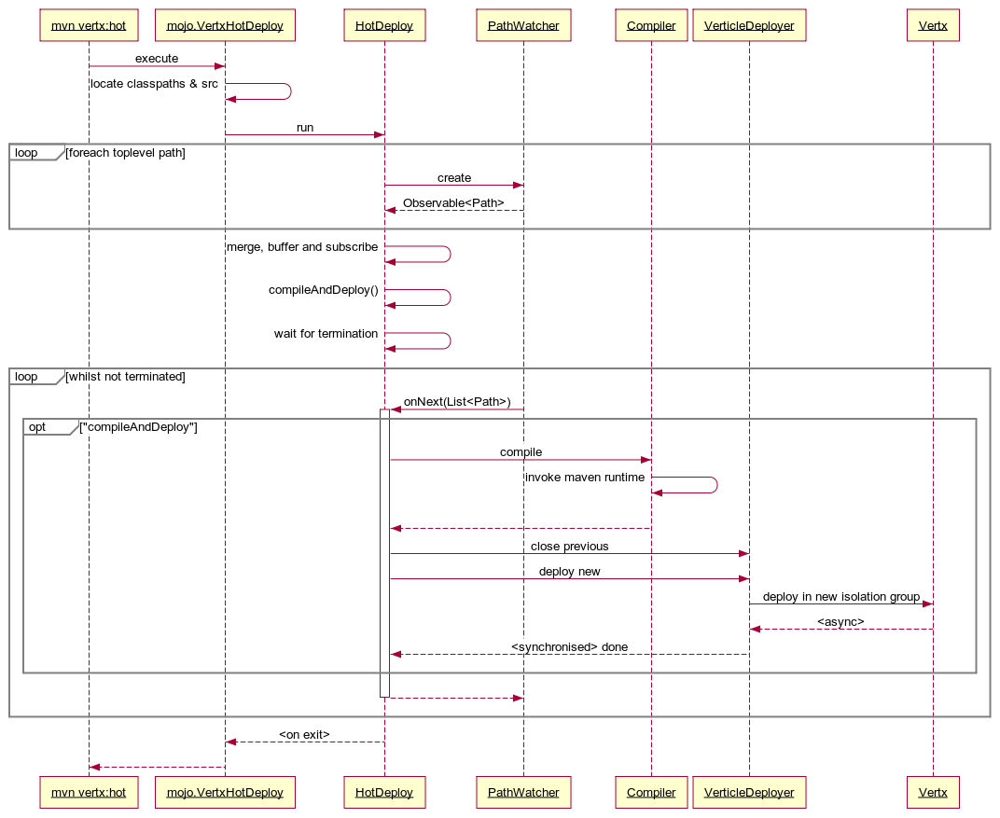

# vertx:hot
### A Maven plugin for hot reload of Vert.x Verticles
---

[](https://travis-ci.org/dazraf/vertx-hot)

## Contents

1. [Background](#background)
2. [Aims](#aims)
3. [Instructions](#instructions)
4. [Example Project](#example-project)
5. [Design Notes](#design-notes)
6. [Contributors](#contributors)

## Background

[Vert.x](http://vertx.io) is an incredible toolkit for developing high-performance applications.

If you use Maven as well, then this plugin can speed up your dev cycle.

Write your code and see the changes auto reload into your JVM. Fully debuggable.

This plugin was originally written for personal use. Its shared here under the [MIT](https://opensource.org/licenses/MIT) licence.

Contributions most gratefully received and recognised.

## Aims

1. __Detect__ source changes
2. __`compile`__ stale targets
3. __Hot Reload__
4. __Full Debug__ without needing to attach to secondary processes
5. __Intuitive__ integration with Maven toolchain
6. __Fast__ at least much faster than using a manual workflow

## Instructions

### Step 1: Download

Release versions of the plugin are available in [Maven Central](http://search.maven.org/#search%7Cga%7C1%7Ca%3A%22vertx-hot-maven-plugin%22).
Snapshots are available in [Sonatype](https://oss.sonatype.org/content/groups/public/io/dazraf/vertx-hot-maven-plugin).
Zip'd releases are available [here](https://github.com/dazraf/vertx-hot/releases).

Please note: the latest version of the plugin depends on `vert.x 3.1.0`.

### Step 2: Add to your project
Add the following to your project `pom.xml`:

```
<plugin>
    <groupId>io.dazraf</groupId>
    <artifactId>vertx-hot-maven-plugin</artifactId>
    <version>1.0.3</version>
    <configuration>
        <verticleReference>**your verticle classname or service reference**</verticleReference>
        <configFile>**YourVerticleConfigFile**</configFile>
    </configuration>
</plugin>
```

The `configuration` has the following elements:

**Required**

* `verticleClassName` - the fully-qualified reference to the top-level verticle of your application.

**Optional**
 
* `configFile` - the class path to the verticle configuration file. When loaded, `vertx:hot` will add the property `"devmode": true`.

* `liveHttpReload` - when `true`, all web pages served by the application verticles will auto reload 
  when any source is changed. `default: true`
  
* `buildResources` - when set to `true`, any change to files under the resource directories will trigger a `compile`. 
Use this if your resources generate sources. `default: false`

* `notificationPort` - websocket port for browser notifications. Used in conjunction with `liveHttpReload: true`. Default is `9999`. 

### Step 3: Run it

You can run it either on the command line with:

```
mvn vertx:hot
```

Or, in your favourite IDE: 

* __For any IDE__ you'll need a locally installed maven installation. Bundled / Embedded maven installations [do not work](https://github.com/dazraf/vertx-hot/issues/3).

* __IntelliJ IDEA__: 
  * *Run* - open the Maven side-bar, *expand* the `Plugins/vertx` section and *double-click* on `vertx:hot` goal. Any changes to your project's main source (*e.g.* `src/main`) will cause a hot deploy. 
  * *Debug* - *right-click* on the `vertx:hot` goal and *select* `Debug`.
  
* __Eclipse__:
  * *Run* - create maven build runner for `vertx:hot` goal. For Eclipse Mars on OS X, I found I had to set the JAVA_HOME environment variable in the runner. Once setup, `Run` it.
  * *Debug* - as above, but instead of `Run`, `Debug`

### Step 4: Stopping the plugin

Press either: `<Enter>` or  `Ctrl-C`.

## Example Project
There are two simple test project under `example1` and `example2`. 
The latter is an adaption of the excellent [ToDo App](http://scotch.io/tutorials/javascript/creating-a-single-page-todo-app-with-node-and-angular)
by [Scotch](http://scotch.io), with a vert.x reactive flavour.

To run either: 

1. You will need [bower](http://bower.io) on your path.
2. After running `mvn clean install` in the parent directory
3. `cd example1` or `cd example2`
4. `mvn vertx:hot`
5. Browse to [http://localhost:8888](http://localhost:8888)
6. Open up the project in your favourite IDE/Editor and try changing some code or static resources
7. The browser will automatically reload. The IDE/shell console will show the unload | recompile | reload activity.

## Design Notes
 


## Contributors

With many thanks:

* [illuminace](https://github.com/illuminace)
